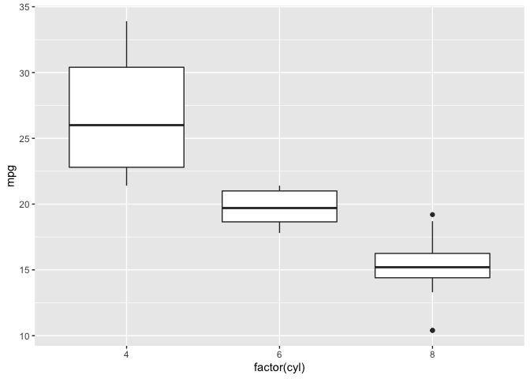

Lab 02 - Merge conflicts
================
Insert your team’s name here
Insert date here

### Load packages and data

``` r
library(tidyverse) 
```

## Make a plot

``` r
ggplot(mtcars, aes(x = factor(cyl), y = mpg)) + geom_boxplot()
```

<!-- -->
